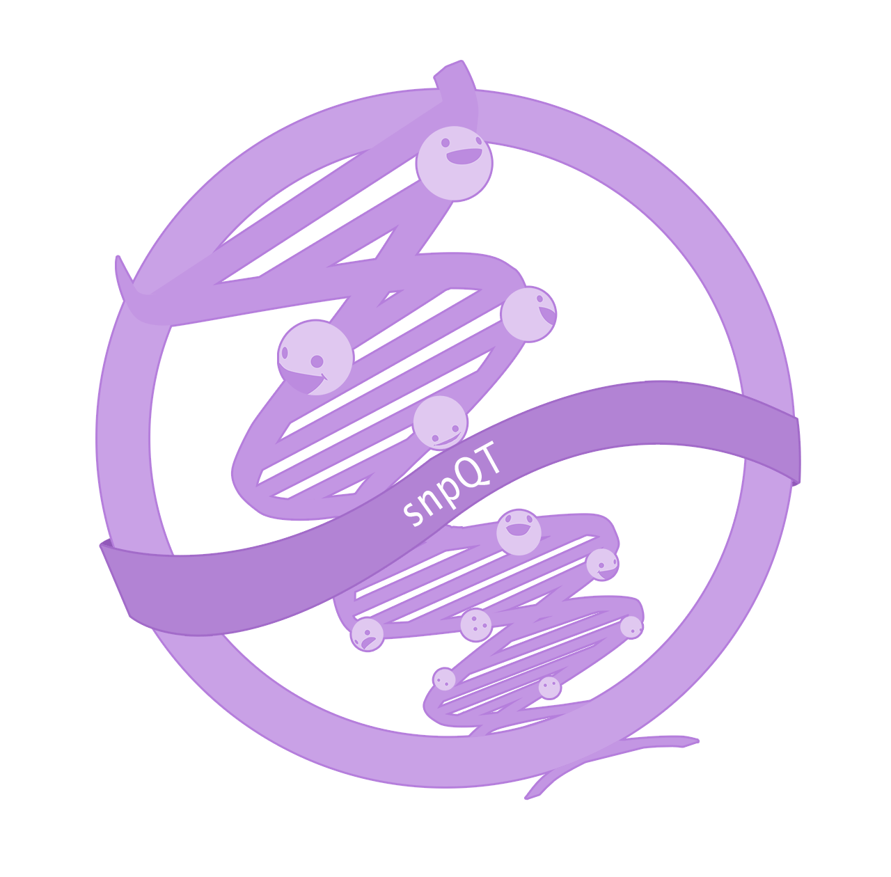

# What is snpQT?

{: style="height:auto;width:50%"}

`snpQT` (pronounced _snip-cutie_) makes your single-nucleotide polymorphisms
cute. Also, it provides support for processing human genomic variants to do: 

* build conversion
* sample quality control
* population stratification
* variant quality control
* pre-imputation quality control
* local imputation
* post-imputation quality control
* genome-wide association studies

with an automated and containerised `nextflow` pipeline.

## Who is snpQT for?

`snpQT` might be useful for you if:

* you want a clean Genomic dataset using a reproducible, fast and comprehensive pipeline
* you are interested to identify significant SNP associations to a trait
* you want to identify ethnic outliers
* you wish to perform imputation locally
* you wish to prepare your genomic dataset for imputation in an external server (following a comprehensive QC and a pre-imputation QC preparation)

## What do you need to get started?

* you have already called your variants using human genome build 37 or 38
* your variants are in VCF or `plink` bfile format
* your variants have "rs" ids
* your samples have either a binary or a quantitative phenotype

If this sounds like you, check out the [installation
guide](user-guide/installation.md) and [quickstart](user-guide/quickstart.md).

`snpQT` definitely won't be useful for you if:

* you want to do quality control on raw sequence reads (try
  SOFTWARE ALTERNATIVE HERE)
* you want to call variants from raw sequence reads (try SOFTWARE ALTERNATIVE
  HERE)
* you are working on family GWAS data
* you're not working with human genomic data (how did you get here?! check out the fantastic [SqueezeMeta](https://github.com/jtamames/SqueezeMeta))

## Citation

If you find `snpQT` useful please cite:

_our cool paper_

## License and third-party software 

`snpQT` is distributed under [a GPL3 license](https://github.com/nebfield/snpQT/blob/master/LICENSE.md). Our pipeline wouldn't be possible without the following amazing third-party software:

| Software                                                        | Version   | Reference                                                                                                                                                                   | License            |
|-----------------------------------------------------------------|-----------|-----------------------------------------------------------------------------------------------------------------------------------------------------------------------------|--------------------|
| [eigensoft](https://www.hsph.harvard.edu/alkes-price/software/) | 7.2.1     | Price, Alkes L., et al. "Principal components analysis corrects for stratification in genome-wide association studies." Nature genetics 38.8 (2006): 904-909.               | Custom open source |
| [impute5](https://jmarchini.org/impute5/)                       | 1.0       | Rubinacci, Simone, Olivier Delaneau, and Jonathan Marchini. "Genotype imputation using the positional burrows wheeler transform." PLoS Genetics 16.11 (2020): e1009049.APA  | Academic use only  |
| [nextflow](https://nextflow.io)                                 | 20.10.0   | Di Tommaso, Paolo, et al. "Nextflow enables reproducible computational workflows." Nature biotechnology 35.4 (2017): 316-319.                                               | GPL3               |
| [picard](https://broadinstitute.github.io/picard/)              | 2.24.0    |                                                                                                                                                                             | MIT                |
| [plink](https://www.cog-genomics.org/plink/1.9/)                | 1.90b6.18 | Purcell, Shaun, et al. "PLINK: a tool set for whole-genome association and population-based linkage analyses." The American journal of human genetics 81.3 (2007): 559-575. | GPL3               |
| [plink2](https://www.cog-genomics.org/plink/2.0/)               | 2.00a2.3  | Chang CC, Chow CC, Tellier LCAM, Vattikuti S, Purcell SM, Lee JJ (2015) Second-generation PLINK: rising to the challenge of larger and richer datasets. GigaScience, 4.     | GPL3               |
| [samtools](https://samtools.github.io)                          | 1.11      | Danecek,  P.et al.(2021).   Twelve  years  of  SAMtools  and  BCFtools.GigaScience,10(2), 1–4                                                                                                                                                                           | MIT                |
| [shapeit4](https://odelaneau.github.io/shapeit4/)               | 4.1.3     | Delaneau, Olivier, et al. "Accurate, scalable and integrative haplotype estimation." Nature communications 10.1 (2019): 1-10.                                               | MIT                |
| [snpflip](https://github.com/biocore-ntnu/snpflip)              | 0.0.6     |                                                                                                                                                                             | MIT                |

We also use countless other bits of software like R, the R tidyverse, etc. 
