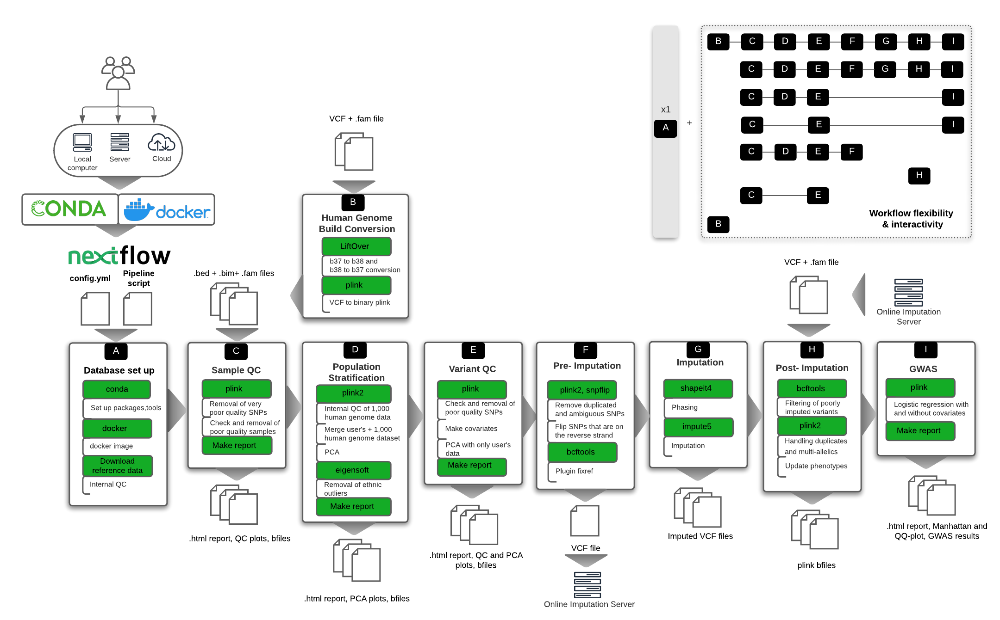
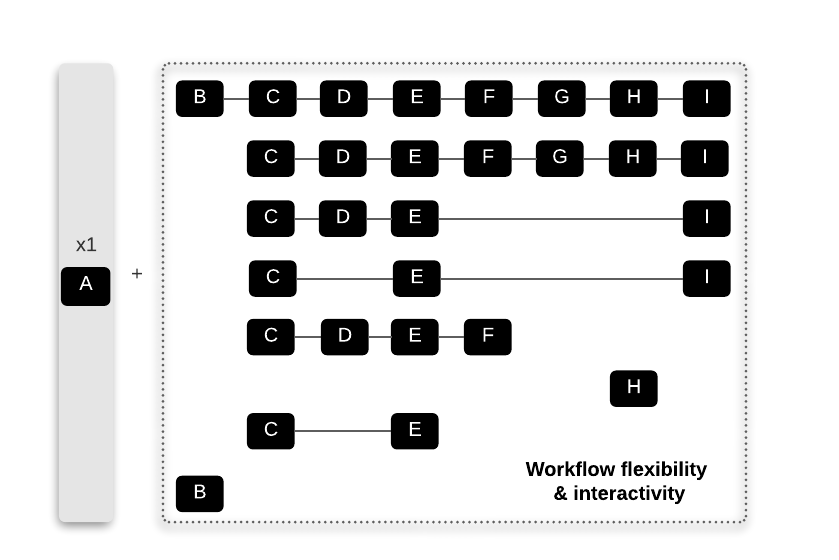

# Background

A rapid explosion in the quantity of genomic data has created the need for systematic and standardised quality control (QC). Assuring high data quality is necessarily a complex multi-step procedure, but it is critical to generate reproducible and reliable results in Genome-Wide Association Studies (GWAS).  `snpQT` is a user-friendly tool which tests and assures the high quality of the user's data, providing ready-to-publish graphs and plots which are useful for data intepretation and validation, bringing the researcher closer to their data.

**How does it work?**

`snpQT` is comprised of nine different interconnected workflows, as seen in the Figure below. 

The incorporated workflows include the following:

- **A: Database set up**: Download and pre-processing steps of the reference data (e.g. EBI's 1,000 Human Genome Data in Human Genome Build 37)

- **B: Human Genome Build Conversion**: An optional workflow to convert user's data from human genome build 38 to 37, the build in which `snpQT` currently processes genomic data, as well as convert b37 back to b38 to support users that prefer this particular genome build (e.g. using external imputation servers that support b38 reference genomes like TOPMed)

- **C: Sample Quality Control**:  Processes that ensure the quality of the genomic samples (e.g. checking samples' call rates, sex discrepancies, cryptic relatedness, etc.)

- **D: Population Stratification**: Automatic identification and visualization of ethnic outliers and inner population structure

- **E: Variant Quality Control**: Processes that ensure the quality of the genotyped Single Nucleotide Polymorphisms (SNPs) (e.g. checking variant call rate, Hardy Weinberg Equilibrium, etc.)

- **F: Pre-Imputation Quality Control**: Processes that ensure that the user's dataset is compatible with phasing and imputation 

- **G: Phasing and Imputation**: Local phasing using `shapeit4`, and imputation using `impute5`

- **H: Post-Imputation Quality Control**: Removal of low quality SNPs, handling of multiple SNP id duplicate categories, and automatic phenotypic update of the VCF files

- **I: GWAS**: Genome-Wide Association Study analysis, using covariates which can be inserted by the user or automatically using the first Principal Components taking into account remaining fine-scale population structure.

A more in-depth and step-by-step view of the workflows is presented in the [Workflow description](workflows.md) section.

`snpQT`  provides the options to:

- use default mode which includes running all workflows (as seen in the Figure above)

- run alternative paths using different compatible combinations of workflows (examples shown in the upper right corner in the figure above and in the zoomed figure below).

Below, we show some examples of alternative pathways that would suit the preferences and needs of multiple users. Database set up (Workflow A) is only run once in the beginning downloading and preparing all the reference data for the subsequent workflows.

The following table summarizes the functions and the dependencies of all the implemented parameters among all workflows. Parameters with brackets concern the default thresholds used among several `snpQT` processes. These parameters are optional and if the user wants to use the default parameter, these parameters do not need to be specified when running `snpQT`. The parameters without brackets concern workflow parameters. 

| Parameter           | Function                                   | Dependency |
|---------------------|--------------------------------------------|------------|
| `--convert_build`   | Convert b38 human genome build data to b37 (default) and vice versa| none       |
| `--qc`              | Sample and variant quality control (QC)    | none       |
| `--pop_strat`       | Population stratification                  | `--qc`     |
| `--pre_impute`      | Pre-Imputation QC                           | `--qc`     |
| `--impute`          | Pre-Imputation QC, Phasing, Imputation and Post-Imputation  QC  | `--qc` + `--pop_strat`|
| `--post_impute`     | Post-Imputation QC   | none |
| `--gwas`            | Genome-Wide Association Analysis           | `--qc`, `--qc` + `--pop_strat`, `--qc` + `--pop_strat` + `--impute`|
| `--bed`, `--bim`, `--fam` | Path to input binary PLINK files [.bed](https://www.cog-genomics.org/plink2/formats#bed), [.bim](https://www.cog-genomics.org/plink2/formats#bim) and [.fam](https://www.cog-genomics.org/plink2/formats#fam) | `--qc`|
| `--vcf` | Path to a [Variant Call Format](https://samtools.github.io/hts-specs/VCFv4.1.pdf) file | `--convert_build`|
| `--input_build [38 (default),37]` | Assign which built your input data are aligned | `--convert_build` |
| `--output_build [37 (default),38]` | Assign which built your output data are going to be aligned | `--convert_build` |
| `--mem [16 (default)]` | Assign the memory size that the LiftoverVCF utility can use | `--convert_build` |
| `--sexcheck [true (default),false]` | When set to false the sex check step in Sample QC is skipped | `--qc`|
| `--keep_sex_chroms [true (default),false]` | When set to false the sex chromosomes are removed | `--qc`|
| `--mind [0.02 (default), 0-1]`     | Change the default sample call rate threshold | `--qc`|
| `--king_cutoff [0.125 (default), 0-1]` | Change the default `plink2`’s [relationship-based pruning](https://www.cog-genomics.org/plink/2.0/distance#king_cutoff) threshold | `--qc`|
| `--hwe [1e-7 (default), 0-1]`     | Change the default Hardy-Weinberg Equilibriem p-value threshold | `--qc`|
| `--heterozygosity [true (default),false]` | When set to false, it skips the heterozygosity check step | `--qc`|
| `--variant_geno [0.02 (default), 0-1]` | Change the default variant call rate threshold | `--qc`|
| `--maf [0.05 (default), 0-1]`      | Change the default minor  allele frequency threshold | `--qc`|
| `--missingness [1e-7(default), 0-1]` | Change the default p-value threshold for missingness vs case/control status| `--qc`|
| `--rm_missing_pheno [false (default),true] ` | Remove samples with a missing phenotype| `--qc`|
| `--indep_pairwise ["50 5 0.2" (default),""]`| Change the default [pruning parameters](http://zzz.bwh.harvard.edu/plink/summary.shtml#prune) | `--qc`, `--qc` + `--pop_strat`|
| `--pca_covars [3 (default), 1-20]`| Change the default number of first Principal Components which are used to create a covariates file |`--qc` + `--gwas`|
| `--covar_file [false (default), covar.txt]`| Import your own custom covariates file for GWAS workflow| `--qc` + `--gwas`|
| `--linear [false (default), true]`| Use when quantitative data are imported | `--qc` |
| `--racefile [super (default), sub]` | Change the default Variant Call Rate threshold | `--qc` + `--pop_strat`|
| `--racecode [""(default), EUR/AFR/SAS... ]` | Change the population codes that you wish to include in the poplist.txt file that is used in `smartpca` | `--qc` + `--pop_strat`|
| `--parfile [false (default), parfile.txt]` | Change the optional parameters to the parameter file for `smartpca` | `--qc` + `--pop_strat`|
| `--impute_maf [0.01 (default), 0-1]`| Change the default Minor Allele Frequency threshold in Post-Imputation|`--impute`|
| `--info [0.7 (default), 0-1]`      | Change the default Info score | `--impute`|
| `--impute_chroms [1(default), 1-23]`      | Controls the number of chromosomes that are imputed at the same time | `--impute`|

